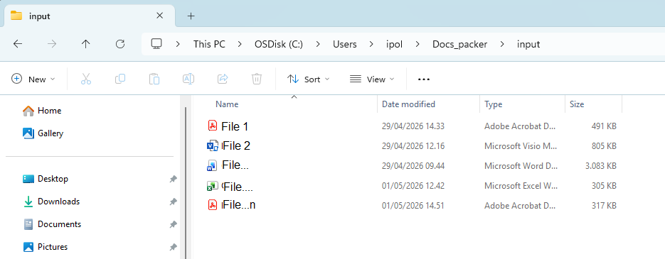
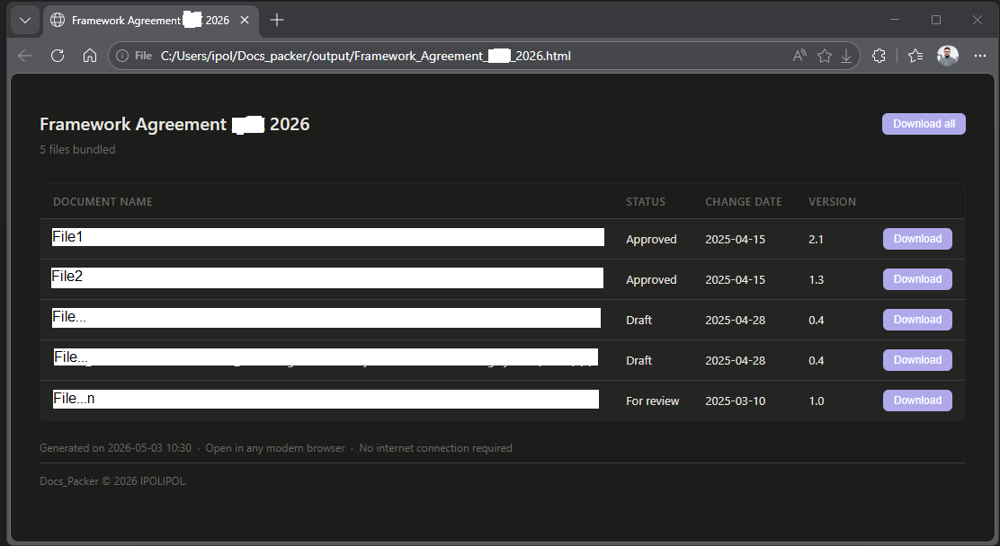

# Docs_Packer — Bundle Documents into a Single HTML File

Docs_Packer is a tool that converts a folder of documents (PDF, Word, Excel, images, etc.) into a single self-contained HTML file with an informative table and download links.

It is designed for sharing document packages via email without relying on ZIP files or cloud storage.

## Use Cases

Docs_Packer is useful in situations where traditional file sharing methods fall short:

**Email-first sharing** — When recipients have limited or no access to cloud platforms (SharePoint, Google Drive, Dropbox, etc.), or when you simply prefer sending everything as a single email attachment. One clean HTML file replaces a ZIP archive, which is merely a file container with no support for structured metadata or semantic organization.  
**Controlled or restricted environments** — Ideal for clients, partners, or internal teams working in secure environments where external cloud links are blocked or discouraged.  
**Custom presentation & navigation** — Even when cloud platforms are available, they often lack the flexibility you want. With Docs_Packer you fully control the layout, table columns, grouping, and descriptions. You can highlight important files, add context, or mirror your preferred folder structure visually.  
**Repeatable document packages** — Perfect for recurring deliveries (project updates, monthly reports, training materials, audit packs, etc.). Just drop the latest files into the `input/` folder, run the tool, and you instantly get a fresh, professional HTML package. No need to write long explanatory emails — the table itself clearly shows what’s included and what’s new.  
**Archival & offline access** — Creates a self-contained, future-proof archive that works completely offline and can be saved locally or stored for long-term reference.

#### Why not just send a Zip archive?
A zip file forces the recipient to download and extract files before they can be used — resulting in a messy list of files with no context. The sender can barely define how the documents are presented - ZIP archives provide no structure or presentation control.

#### Docs_Packer solves these problems and gives you much more:

- A professional, well-organized table view right after opening the file
- Customizable metadata (descriptions, versions, status, notes, etc.)
- Ability to highlight important files or group them logically
- Instant access — all files are available immediately

| Feature                  | ZIP Archive | Docs_Packer |
|--------------------------|-------------|-------------|
| Single file              | ✔          | ✔          |
| Works offline            | ✔          | ✔          |
| No extraction needed     | ✗          | ✔          |
| Structured view          | ✗          | ✔          |
| Custom-defined Metadata  | ✗          | ✔          |
| Presentation control     | ✗          | ✔          |

This makes the experience significantly better for the recipient and reduces follow-up questions for the sender. Sender gets full creative control over how the documents are presented.

## How it works

Docs_Packer embeds all input files directly into a single HTML file using Base64 encoding.

The HTML file contains:
- The document data
- A generated table UI with the user-defined meta-information/semantics  
- Download function - user can download any single file or all of them   

This makes the output fully portable and independent of external systems.

#### Quick Example

The files placed to the `input/` folder:   



Resulting `.html` file: 



## Repository structure

```
docs_packer/
│
├── schema.py          ← EDIT THIS to add/rename/remove table columns
├── metadata.py        ← EDIT THIS to describe your files
│
├── pack_bundle.py     ← RUN THIS to build the bundle
├── validate.py        ← validation logic (do not edit unless you modify the program)
├── test_validate.py   ← program self-tests (run only if you modify the program)
│
├── input/             ← DROP YOUR FILES HERE
└── output/            ← generated HTML bundle appears here
```

## Normal workflow — step by step

### Step 1 — Drop your files into `input/`

Copy all documents you want to bundle into the `input/` folder.
File names, extensions, and casing all matter — they must match exactly what
you write in `metadata.py`.

### Step 2 — Describe your files in `metadata.py`

Open `metadata.py`. Add one entry per file inside the `FILES = [...]` list.
Each entry is a Python dict. The keys must match what is defined in `schema.py`.

Example entry:
```python
{
    "filename":    "Rate_Schedule.xlsx",   # exact filename inside input/
    "name":        "Rate Schedule",        # display name in the table
    "status":      "Approved",
    "change_date": "2025-04-15",           # format: YYYY-MM-DD
    "version":     "1.3",
},
```

### Step 3 — Run the packer

```
python pack_bundle.py --title "Very important documents Q2-2025"
```

The script will:
1. Validate your `schema.py` and `metadata.py` automatically
2. Print a clear report if anything is wrong — and stop without building
3. Read each file from `input/`
4. Write the HTML bundle to `output/`

If there are errors, fix them and run again. The bundle is only built when
everything is clean.

### Step 4 — Send the output file

The generated `.html` file in `output/` is fully self-contained.
Attach it to an email. The recipient:
- Downloads it
- Double-clicks it (opens in Edge or Chrome on Windows)
- Sees a table of all documents
- Clicks Download on any row to save that file locally

No internet connection, no installation, no unzipping required.

## Changing the table columns

All column definitions live in `schema.py` — this is the single place to edit.

**To add a column:**
1. Add an entry to `COLUMNS` in `schema.py`
2. Add the same key to every entry in `metadata.py`
3. Run `pack_bundle.py` — validation will tell you if you missed anything

**To remove a column:**
1. Remove the entry from `COLUMNS` in `schema.py`
2. The key can stay in `metadata.py` (it will be ignored with a warning) or you
   can clean it up

**To rename a column header:**
Change the `"label"` value in `schema.py`. The key and all metadata stay the same.

**Column definition fields:**

| Field      | Required | Description                                        |
|------------|----------|----------------------------------------------------|
| `key`      | yes      | Internal identifier. Must match keys in metadata.py |
| `label`    | yes      | Header text shown in the HTML table                |
| `required` | yes      | `True` = every file entry must have this field     |
| `type`     | yes      | `"text"`, `"date"`, or `"version"`                 |

## Validation — what is checked automatically

Every run of `pack_bundle.py` checks:

**Schema (`schema.py`)**
- Every column entry has all required fields (`key`, `label`, `required`, `type`)
- No two columns share the same `key`
- `type` is one of the allowed values
- `required` is `True` or `False` (not a string)

**Metadata (`metadata.py`)**
- Every entry has a `filename`
- No duplicate filenames
- Every field marked `required: True` in schema is present in every entry
- Date fields follow `YYYY-MM-DD` format
- Every filename in metadata has a matching file in `input/`

**Warnings (bundle is still built)**
- A key in metadata is not defined in schema (will be ignored)
- A file exists in `input/` but has no entry in metadata

## Command-line options

```
python pack_bundle.py --title "My Bundle"        # sets the page title (default: "Document bundle")
python pack_bundle.py --output custom_name.html  # sets the output filename
python pack_bundle.py                            # uses defaults
```

## Running the program self-tests

Only needed if you modify `validate.py` or `pack_bundle.py`.

```
python test_validate.py
```

Expected output: `23/23 tests passed — all good.`

## Requirements

- Python 3.7 or newer
- No external packages required (standard library only)
- Output file: any modern browser on Windows (Edge, Chrome, Firefox)

## File name rules and limitations

File names are used directly as-is from `input/` and passed into the HTML and
JavaScript of the bundle. Certain characters can break the download or cause
the browser to mishandle the file.

**Safe file names must:**
- Use ASCII characters only (a–z, A–Z, 0–9)
- Use underscores `_` or hyphens `-` instead of spaces
- Avoid these special characters: `# % & ? + \ ' " ` ( ) [ ] { }`
- Be shorter than 120 characters

**Examples:**

| ✗ Avoid                      | ✓ Use instead                |
|-------------------------------|-------------------------------|
| `FA Rev 2.1 (FINAL).pdf`      | `FA_Rev2.1_FINAL.pdf`         |
| `Scope & Cost #3.xlsx`        | `Scope_and_Cost_3.xlsx`       |
| `P&ID_rev"3".dwg`             | `P-ID_rev3.dwg`               |
| `Протокол_совещания.docx`     | `Meeting_Minutes.docx`        |

**Why spaces specifically:** spaces in filenames are technically allowed and
will usually work, but some email clients and browsers encode them
inconsistently. Using `_` is the safest habit.

**Why non-ASCII (Cyrillic, etc.):** the HTML bundle itself handles UTF-8
correctly, but Windows download dialogs and some email clients can corrupt
non-ASCII filenames. Keep filenames in ASCII; use the `"name"` field in
`metadata.py` for the full human-readable display name in any language.

## Practical size limits

| Total payload   | Behavior                                           |
|-----------------|----------------------------------------------------|
| Up to ~100 MB   | Works without issues                               |
| 100 – 200 MB    | Works, browser may be slower to open               |
| Over 200 MB     | Consider splitting into multiple themed bundles    |

## Category

This project belongs to:
- File packaging tools
- Static HTML generators
- Offline document viewers

## Keywords

document packaging, html bundle generator, file bundler, python html generator,
embed files in html, zip alternative, email file sharing,
self-contained html, document delivery tool, no cloud file sharing

## License

Docs_Packer is open source and released under the MIT License.
This license allows you to freely use, modify, and distribute the software for both personal and commercial purposes.
While the MIT License permits anyone to fork or reimplement the project, the core idea, user experience, and design of Docs Packer are the result of careful thought and iteration. We kindly ask that if you build upon this project, you:
- Give appropriate credit to the original work
- Consider contributing any improvements back to the community
 
If you're looking for additional features (custom branding, password protection, advanced customization, etc.), commercial licensing, or support, feel free to reach out.

© 2026 IPOLIPOL. All rights reserved.
Docs_Packer is a trademark of IPOLIPOL.